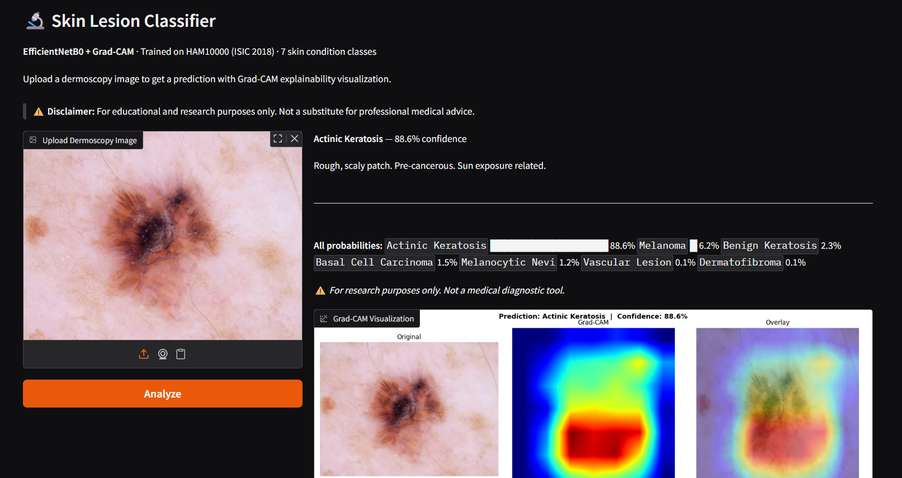

# 🔬 Skin Lesion Classification — Medical Image Diagnosis

<div align="center">


**[🚀 Live Demo on Hugging Face Spaces](https://huggingface.co/spaces/CaringNihilistic/skin-lesion-classifier)**

</div>

---

## Overview

A deep learning system for classifying dermoscopy images into 7 skin condition categories, trained on the **HAM10000 / ISIC 2018** dataset. The model uses **EfficientNetB2** fine-tuned with a two-phase training strategy, **Focal Loss** for class imbalance, and **Grad-CAM** for visual explainability — making predictions interpretable for clinical review.

> ⚠️ **Disclaimer:** For educational and research purposes only. Not a certified medical diagnostic tool. Always consult a qualified dermatologist.

---

## Results

| Metric | Value |
|--------|-------|
| **Test Accuracy** | **85.1%** |
| **Macro ROC-AUC** | **0.97** |
| **Weighted ROC-AUC** | **0.96** |
| Model | EfficientNetB2 (timm) |
| Dataset | HAM10000 — 10,015 images |
| Classes | 7 |
| Hardware | NVIDIA RTX 3050 (4GB VRAM) |

### Per-Class Performance

| Class | Precision | Recall | F1 | ROC-AUC |
|-------|-----------|--------|----|---------|
| Actinic Keratosis | 0.673 | 0.714 | 0.693 | 0.982 |
| Basal Cell Carcinoma | 0.760 | 0.779 | 0.769 | 0.985 |
| Benign Keratosis | 0.687 | 0.691 | 0.689 | 0.945 |
| Dermatofibroma | 0.846 | 0.647 | 0.733 | 0.985 |
| Melanocytic Nevi | 0.920 | 0.939 | 0.930 | 0.964 |
| **Melanoma** | 0.649 | 0.575 | 0.610 | 0.925 |
| Vascular Lesion | 1.000 | 0.818 | 0.900 | 0.997 |

---

## Demo

Upload any dermoscopy image and get:
- **Predicted class** with confidence score
- **All class probabilities** as a bar chart
- **Grad-CAM heatmap** showing which skin regions influenced the prediction



---

## Dataset

**HAM10000** (Human Against Machine with 10000 training images) — ISIC 2018 Task 3

| Class | Code | Count | Description |
|-------|------|-------|-------------|
| Melanocytic Nevi | NV | 6,705 | Common mole — dominant class (67%) |
| Melanoma | MEL | 1,113 | Most dangerous skin cancer |
| Benign Keratosis | BKL | 1,099 | Non-cancerous growth |
| Basal Cell Carcinoma | BCC | 514 | Most common skin cancer |
| Actinic Keratosis | AKIEC | 327 | Pre-cancerous lesion |
| Vascular Lesion | VASC | 142 | Blood vessel abnormality |
| Dermatofibroma | DF | 115 | Harmless fibrous nodule |

**Split:** 70% train / 15% val / 15% test (stratified by class)

---

## Architecture & Key Design Decisions

### Model — EfficientNetB2
- Pretrained on ImageNet, fine-tuned on dermoscopy images
- Input resolution: 260×260
- Two-phase training strategy:
  - **Phase 1 (5 epochs):** Freeze backbone, train classifier head only — preserves pretrained features
  - **Phase 2 (30 epochs):** Unfreeze all layers, fine-tune with low LR + cosine annealing

### Class Imbalance (11:1 ratio)
Three techniques combined:
1. **WeightedRandomSampler** — oversamples rare classes each epoch so the model sees MEL and DF more often
2. **Sqrt inverse frequency weights** — gentler than raw inverse, passed to loss function
3. **Focal Loss (γ=2.0)** — down-weights confident easy predictions, forces focus on hard examples

### Grad-CAM Explainability
- Hooks registered on `model.conv_head` (last convolutional layer)
- Produces heatmaps showing which skin regions drove the prediction
- Essential for medical use — allows clinicians to verify model attention

### Critical Bug Fixed: BatchNorm Corruption
During Phase 1, `model.train()` was resetting frozen BatchNorm layers back to training mode, overwriting pretrained ImageNet statistics with skin lesion data every epoch. Fix: explicitly call `.eval()` on all frozen BN layers after every `model.train()` call. This single fix improved accuracy from **57% → 85%**.

### Training Optimizations
- **AMP (Automatic Mixed Precision)** — faster training on 4GB VRAM
- **Gradient clipping** (max_norm=1.0) — prevents exploding gradients
- **AdamW** with weight decay — decoupled regularization
- **ReduceLROnPlateau** in Phase 1, **CosineAnnealingLR** in Phase 2
- **RandomErasing** (p=0.2) — removes dermoscopy artifacts (ruler marks, hair)

---

## Project Structure

```
skin-lesion/
│   ├── prepare_data.py     # Download ISIC dataset, build splits
│   ├── dataset.py          # PyTorch DataLoader + transforms + WeightedSampler
│   ├── model.py            # EfficientNetB2 + BN fix + AdamW
│   ├── train.py            # Training loop + Focal Loss + full metrics
│   └── gradcam.py          # Grad-CAM implementation
│   ├── main.py             # FastAPI backend (local)
│   └── index.html          # Frontend UI
├── app.py                  # Hugging Face Spaces (Gradio)   
├── demo.png
└── requirements.txt
```

---

## Setup & Training

### 1. Clone and install
```bash
git clone https://github.com/CaringNihilistic/skin-lesion-classifier
cd skin-lesion-classifier
conda create -n skin-lesion python=3.11 -y
conda activate skin-lesion
pip install torch torchvision --index-url https://download.pytorch.org/whl/cu121
pip install -r requirements.txt
```

### 2. Download dataset
Place your `kaggle.json` at `~/.kaggle/kaggle.json`, then:
```bash
python src/prepare_data.py
```

### 3. Train
```bash
cd src
python train.py
```
Expected: ~3 hours on RTX 3050, ~45 mins on T4 (Colab)

### 4. Run locally
```bash
cd app
uvicorn main:app --reload
# Open http://localhost:8000
```

---

## Solved Technical Challenges

| Challenge | Solution |
|-----------|----------|
| BatchNorm corruption during Phase 1 freeze | Re-apply `.eval()` to frozen BN after every `model.train()` call |
| 11:1 class imbalance (NV dominant) | WeightedRandomSampler + sqrt inverse weights + Focal Loss |
| Dermoscopy artifacts (hair, ruler marks) | RandomErasing augmentation (p=0.2) |
| 4GB VRAM constraint | AMP + batch_size=16 + gradient checkpointing |
| Melanoma/NV visual similarity | EfficientNetB2 (higher resolution) + Focal Loss γ=2.0 |
| Deprecated PyTorch APIs | Updated to `torch.amp.GradScaler('cuda')`, `weights_only=False` |

---

## Tech Stack

`Python 3.11` · `PyTorch 2.x` · `timm` · `EfficientNetB2` · `Grad-CAM` · `Focal Loss` · `FastAPI` · `Gradio` · `Hugging Face Spaces` · `OpenCV` · `scikit-learn` · `Optuna`

---

## License

MIT License — free to use for research and educational purposes.

---

<div align="center">
Built by <a href="https://github.com/CaringNihilistic">Ayush Yadav</a> · 
<a href="https://huggingface.co/spaces/CaringNihilistic/skin-lesion-classifier">Live Demo</a> ·
<a href="https://linkedin.com/in/ayush-yadav-7ba731289">LinkedIn</a>
</div>
